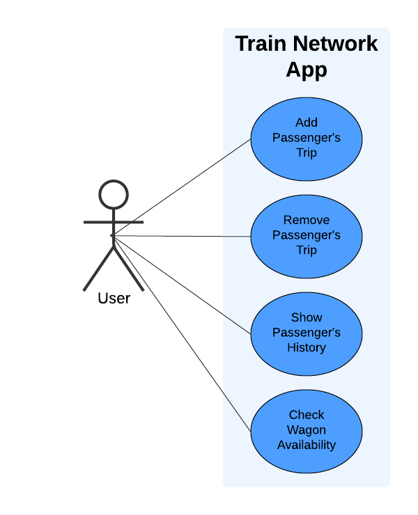

# Dynamic Duo

Train Network App

This project uses C++ to simulate a train network, with core functionality to read initial data from text files to populate a train list and passenger map. Key functions will include adding/removing passenger trips, displaying passenger trip details, listing passengers on specific trains, and ordering passengers alphabetically across trains. Following the C++ backend, a frontend website will be developed to present and manage this data interactively for users

## Team Members and Roles

* [Laura Martin](https://github.com/lauuramarttin/CIS350-HW2-Martin.git) (Team Lead, Back-end developer)
* [Mattew Tonder](https://github.com/mattonder/mattonder-CIS350-HW2-Tonder.git) (Developer, Front-End) 

## Prerequisites

- Knowledge of C++: Ability to develop code using functions and classes.
- Git Proficiency: Knowing how to use Git for version control and collaboration with others.
- Use of Trello: Ability to organize tasks and track project progress.
- Basic Knowledge of HTML and CSS: Understanding how to create the structure and design of a frontend.

## Run Instructions

## Gantt Chart

## Use Case Diagram

## Use Case Diagram - Extended

## Sequence Diagram

