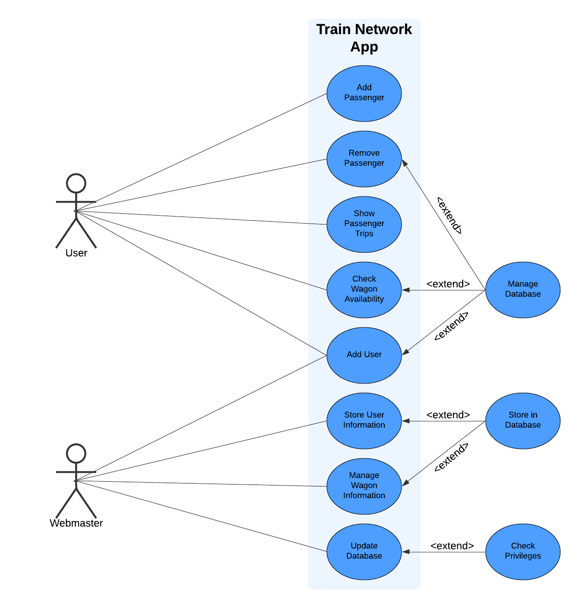
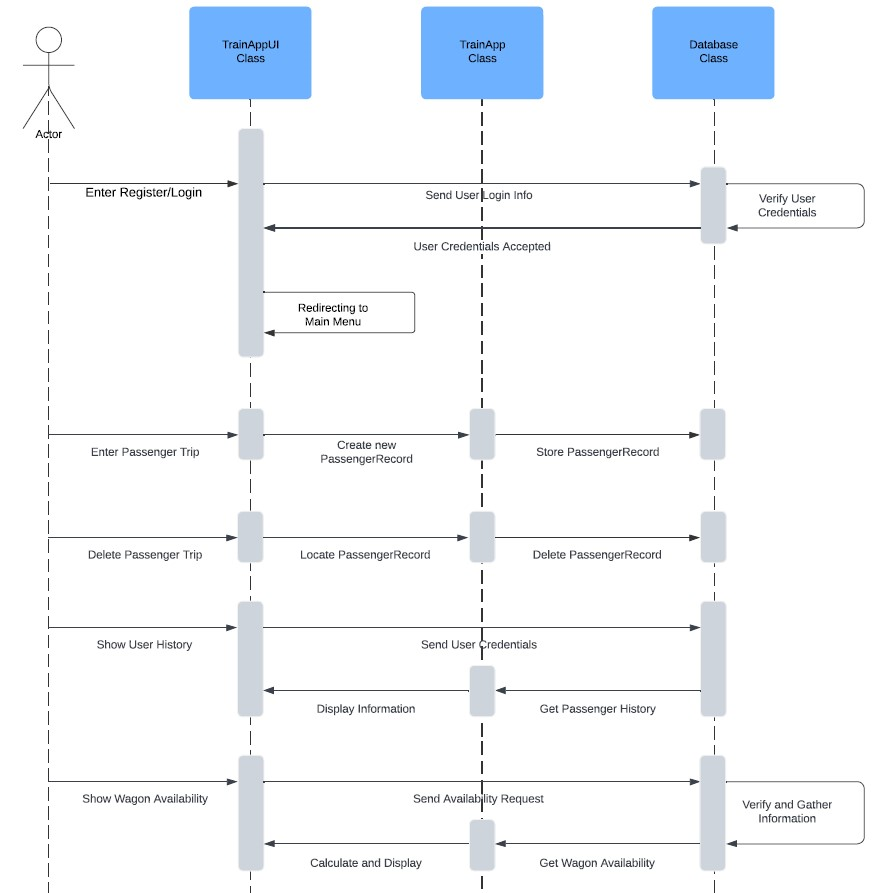

# Dynamic Duo

Train Network App

Our project focuses on developing a train and passenger management system using Python and a database to store and manage travel information. This system allows us to add new trips for passengers, remove existing trips, and query both the trips of a specific passenger and the list of passengers on a particular train. By implementing a database, we can keep the data organized and persistently accessible, improving the efficiency of the system.

## Team Members and Roles

* [Laura Martin](https://github.com/lauuramarttin/CIS350-HW2-Martin.git) (Team Lead, Back-end developer)
* [Mattew Tonder](https://github.com/mattonder/mattonder-CIS350-HW2-Tonder.git) (Developer, Front-End) 

## Prerequisites

- Knowledge of Python: Ability to develop code using functions and classes.
- Knowledge of SQL: Understanding how to manage and query data in a database.
- Git Proficiency: Knowing how to use Git for version control and collaboration with others.
- Use of Trello: Ability to organize tasks and track project progress.
- Basic Knowledge of HTML and CSS: Understanding how to create the structure and design of a frontend.

## Run Instructions

## Gantt Chart

## Use Case Diagram
.png)

## Use Case Diagram - Extended

## Sequence Diagram

