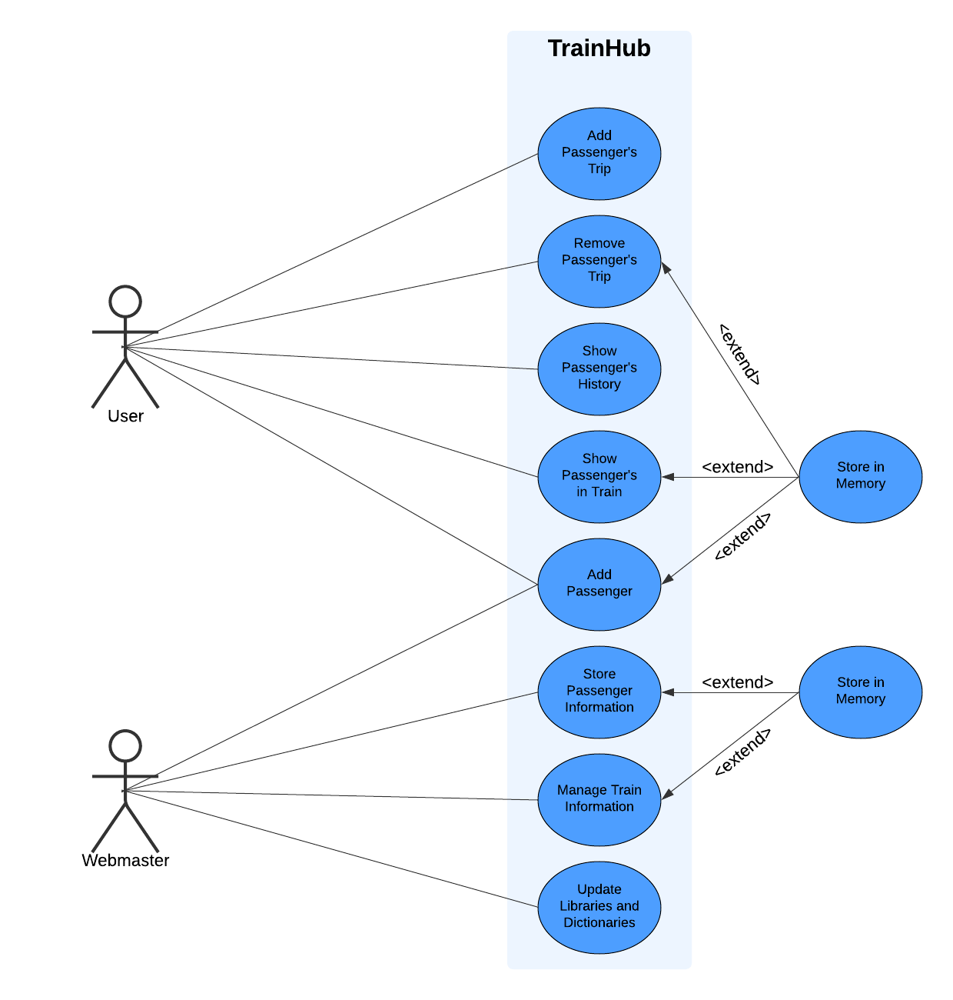

# Dynamic Duo

TrainHub Website

This project uses C++ to simulate a train network, with core functionality to read initial data from text files to populate a train list and passenger map. Key functions will include adding/removing passenger trips, displaying passenger trip details and listing passengers on specific trains. Following the C++ backend, a frontend website will be developed to present and manage this data interactively for users

## Team Members and Roles

* [Laura Martin](https://github.com/lauuramarttin/CIS350-HW2-Martin.git) (Team Lead, Back-end developer)
* [Mattew Tonder](https://github.com/mattonder/mattonder-CIS350-HW2-Tonder.git) (Developer, Front-End) 

## Prerequisites

- Knowledge of C++: Ability to develop code using functions and classes.
- Git Proficiency: Knowing how to use Git for version control and collaboration with others.
- Use of Trello: Ability to organize tasks and track project progress.
- Basic Knowledge of HTML and CSS: Understanding how to create the structure and design of a frontend.

## Installation and Setup
1. **Clone the repository**
   ```bash
   git clone https://github.com/lauuramarttin/GVSU-CIS350-DynamicDuo.git

2. **Navigate to the Source Folder**
   ```bash
   cd GVSU-CIS350-DynamicDuo
   cd src

In the src folder, you will find the three text files with the necessary information to run the program (train.txt, passenger.txt, wagon.txt). The complete program is contained in the file code.c, which is the file you will run.

## Building and Running
1. **Compile the Code**
   Use your preferred C++ compiler to compile the program. For example, using g++:
   ```bash
   g++ -o TrainSystem code.c

2. **Run the Program**
   Execute the compiled program:
   ```bash
   ./TrainSystem

3. **Follow the Menu Options**
   The program will display a menu with options to:
   1. Add a new passenger’s trip to a train.
   2. Remove a passenger’s trip.
   3. Show trips of a passenger.
   4. Show a list of passengers on a specific train.
   5. End the program.

## Output
At the end of the program, updated versions of the input files (train.txt, passenger.txt, wagon.txt) and an additional Output.txt file with organized information will be generated in the same directory.

## Support
For any issues or questions, feel free to contact our team at the following emails:
martinyl@mail.gvsu.edu
tonderj@mail.gvsu.edu
   


## Gantt Chart


## Use Case Diagram


## Use Case Diagram - Extended


## Use Case Diagram Description


## Class Diagram


## Sequence Diagram

